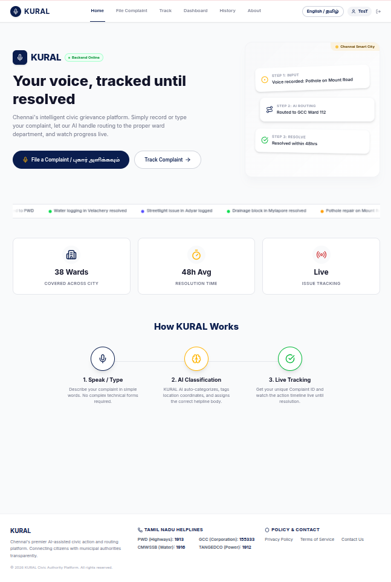
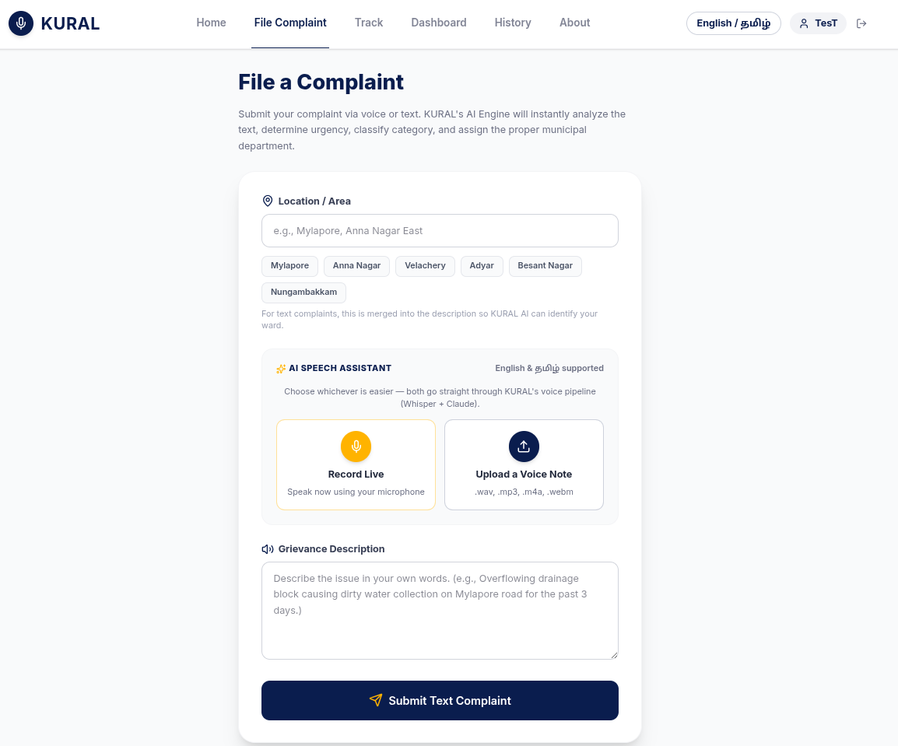
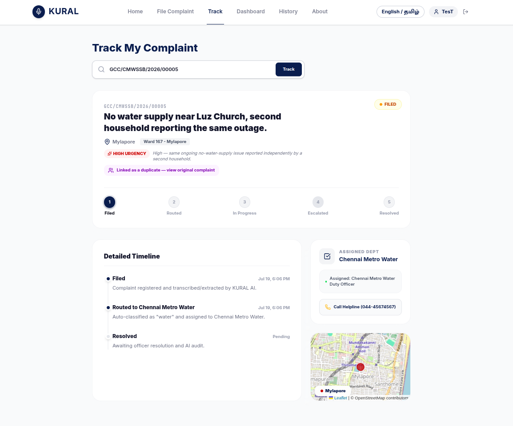
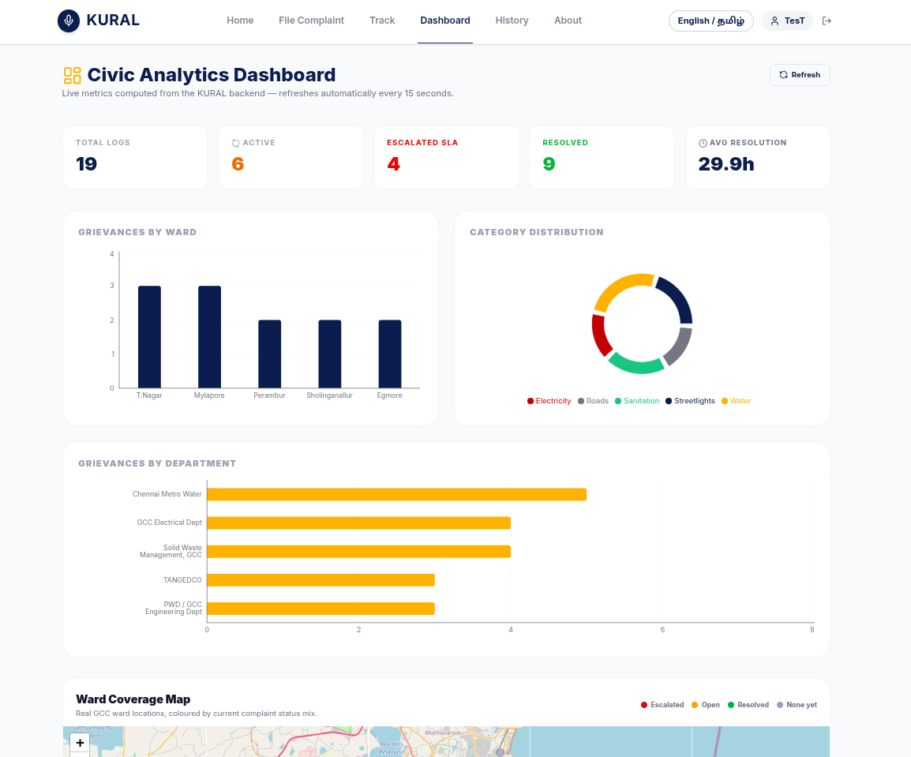
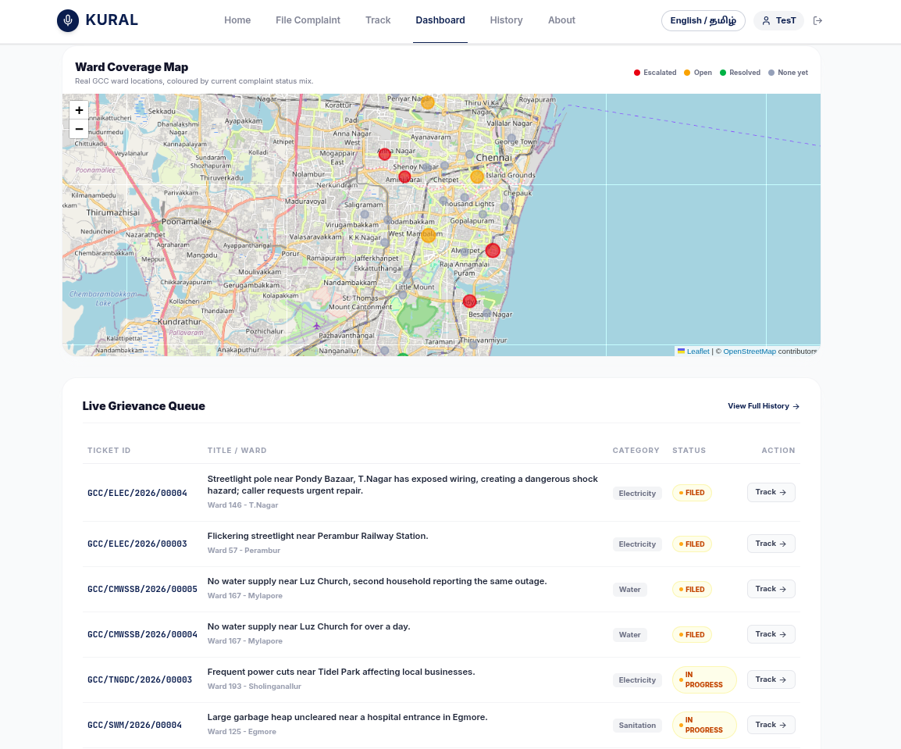
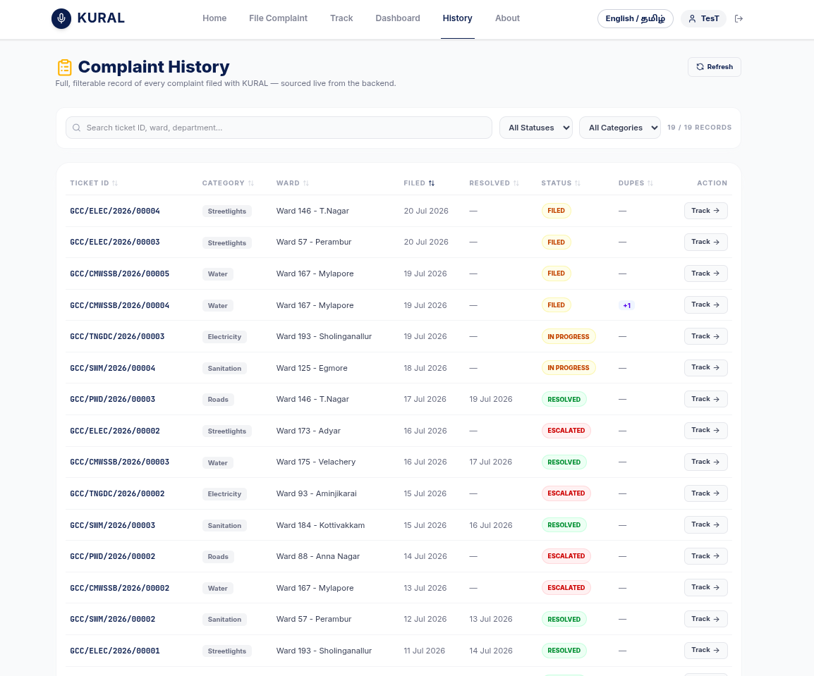
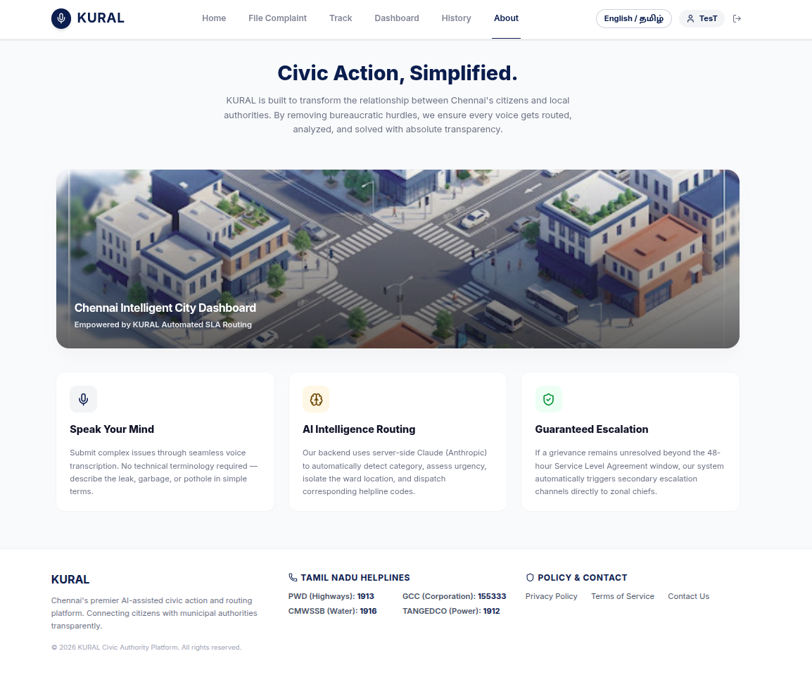
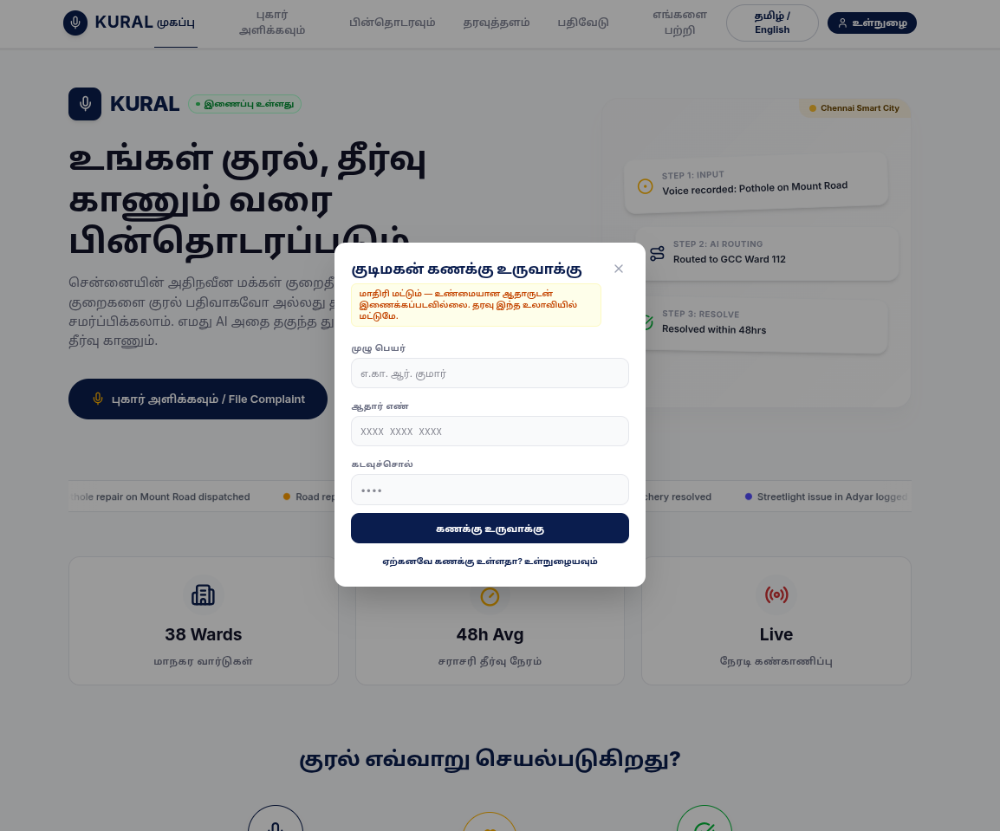

# KURAL

### Voice-first AI civic grievance agent for Chennai

[](https://www.python.org/)
[](https://fastapi.tiangolo.com/)
[](https://react.dev/)
[](https://github.com/openai/whisper)
[](https://www.anthropic.com/)
[](https://github.com/vishal-r-v/KURAL)

**KURAL** (குரல் — *voice*) lets citizens file civic complaints in **Tamil, Tanglish, or English** — by speaking or typing. The system transcribes the complaint, extracts category and location with Claude, routes it to the correct Greater Chennai Corporation department, assigns an SLA, and **audits officer resolutions with an LLM** before closing the ticket.

> Built for **AI for Bharat Hackathon 2026** · Track: Smart Public Transport & Civic Infrastructure

---

## Screenshots

| Home | File complaint | Track |
|:---:|:---:|:---:|
|  |  |  |

| Dashboard | Map & queue | History |
|:---:|:---:|:---:|
|  |  |  |

| About | Citizen login (prototype) |
|:---:|:---:|
|  |  |

---

## Why KURAL is different

Most grievance bots stop at classification and a timer. KURAL adds an **LLM-audited escalation loop**:

| Layer | What happens |
|-------|----------------|
| **Deterministic** | APScheduler owns SLA deadlines and status flips — the LLM never controls timing |
| **Advisory AI** | Claude extracts the complaint at intake, then audits whether a resolution note describes a *real fix* |
| **Visible trail** | Every escalation, reopen, and simulated citizen SMS is logged on a live timeline judges can watch |

If an officer writes “issue noted,” the audit returns **reopen** and the complaint stays escalated. Vague closures do not silently succeed.

---

## Disclosure — what is real vs simulated

| Component | Status |
|-----------|--------|
| Whisper STT, Claude extraction & resolution audit, SQLite, APScheduler, ward/dept routing | **Live** — real API calls and persistence |
| Filing into GCC / CPGRAMS / TANGEDCO / CMWSSB | **Simulated** — no public write-API exists; tickets are stored in KURAL’s own DB |
| Citizen SMS / push notifications | **Simulated** — trail entries prefixed `[SIMULATED SMS]`; no real SMS gateway |
| Citizen Aadhaar login | **Prototype only** — credentials in browser `localStorage`; **not** linked to UIDAI |
| Demo seed complaints | **Synthetic** — clearly marked `[DEMO SEED DATA…]` in transcripts |

Department names, contacts, SLA hours, and **38 Chennai localities** are real seed data. Government filing is the main intentional simplification; the other simulated items above are also disclosed so nothing is presented as a live external integration when it is not.

---

## How it works

```text
  Citizen (voice or text)
           │
           ▼
  ┌────────────────────┐
  │  Whisper STT       │  Tamil / Tanglish / English audio → transcript
  └─────────┬──────────┘
            ▼
  ┌────────────────────┐
  │  Claude extraction │  category · ward · urgency · summary · rationale
  └─────────┬──────────┘
            ▼
  ┌────────────────────┐
  │  Routing engine    │  fuzzy ward match → department + SLA + ticket ID
  └─────────┬──────────┘     e.g. GCC/SWM/2026/00012
            ▼
  ┌────────────────────┐
  │  SQLite + trail    │  duplicate detection · escalation history
  └─────────┬──────────┘
            ▼
  ┌────────────────────┐
  │  SLA poller        │  overdue → escalate (+ simulated SMS log)
  └─────────┬──────────┘
            ▼
  ┌────────────────────┐
  │  Resolution audit  │  genuine → close · insufficient → reopen
  └────────────────────┘
```

**Frontends (same backend):**

| App | Role | URL (local) |
|-----|------|-------------|
| `kural_web/` | Primary citizen website (React + TypeScript) | http://localhost:3000 |
| `frontend/app.py` | Admin / demo dashboard (Streamlit) | http://localhost:8501 |

Citizen features include bilingual UI (English / தமிழ்), voice + text filing, track-by-ticket-ID, escalation timeline, public analytics, ward map (Leaflet + OpenStreetMap), complaint history, and a **prototype-only** Aadhaar login.

---

## Features at a glance

- Voice & text intake with Whisper + Claude function-calling (validated + retry)
- Structured ticket IDs: `GCC/{DEPT}/{YEAR}/{SEQ}`
- 38 Chennai localities with fuzzy ward matching
- Duplicate detection (same category + ward within 24h)
- LLM urgency rationale shown next to the priority badge
- Simulated citizen notification log on escalate / resolve
- Live ward coverage map coloured by complaint status mix
- Demo controls: compress time + force SLA check

---

## Prerequisites

Install these **before** cloning and running the stack:

| Requirement | Why | How to install |
|-------------|-----|----------------|
| **Python 3.10+** | Backend, Streamlit, tests | [python.org](https://www.python.org/downloads/) |
| **Node.js 18+** and **npm** | React citizen website | [nodejs.org](https://nodejs.org/) |
| **ffmpeg** | Required by Whisper for audio decode | see below |
| **Anthropic API key** | Claude extraction + resolution audit | [console.anthropic.com](https://console.anthropic.com/) |
| **Git** | Clone the repository | system package manager |

### Install ffmpeg

**Ubuntu / Debian**

```bash
sudo apt-get update && sudo apt-get install -y ffmpeg
```

**macOS**

```bash
brew install ffmpeg
```

**Windows**

```powershell
# Option A — winget
winget install --id Gyan.FFmpeg -e

# Option B — Chocolatey
choco install ffmpeg
```

Fallback: download a build from [ffmpeg.org](https://ffmpeg.org/download.html) (Windows builds), extract it, and add the `bin` folder to your system **PATH**.

**Verify (all platforms)**

```bash
ffmpeg -version
```

> **Optional:** an NVIDIA NIM API key can be set as a Claude fallback. Claude is the primary LLM in this build. NIM is not required for a working demo.

---

## Quick start

### 1. Clone

```bash
git clone https://github.com/vishal-r-v/KURAL.git
cd KURAL
```

### 2. Python environment

```bash
python3 -m venv venv
source venv/bin/activate          # Windows: venv\Scripts\activate
pip install -r requirements.txt
```

First Whisper run downloads the model weights (`WHISPER_MODEL`, default `small`) — allow a few minutes and a working network connection.

### 3. Environment variables (required)

```bash
cp .env.example .env
```

Edit **`.env`** and set at least:

| Variable | Required | Description |
|----------|----------|-------------|
| `ANTHROPIC_API_KEY` | **Yes** | Your Anthropic key (`sk-ant-…`) |
| `CLAUDE_MODEL` | Recommended | e.g. `claude-haiku-4-5` (fast demo) or a Sonnet model |
| `WHISPER_MODEL` | Optional | `tiny` \| `base` \| `small` \| `medium` \| `large` — default `small` |
| `DB_PATH` | Optional | SQLite path — default `backend/kural.db` |
| `SLA_POLL_INTERVAL_SECONDS` | Optional | SLA poll interval — default `60` |
| `KURAL_BACKEND_URL` | Optional | Streamlit → API URL — default `http://localhost:8000` |
| `NVIDIA_NIM_API_KEY` | Optional | Fallback LLM only |
| `NVIDIA_NIM_MODEL` | Optional | Default `meta/llama-3.3-70b-instruct` |

**Never commit `.env`.** Only `.env.example` (placeholders) is in the repo.

### 4. Start the backend

```bash
source venv/bin/activate
uvicorn backend.main:app --host 0.0.0.0 --port 8000 --reload
```

| Check | URL |
|-------|-----|
| Health | http://localhost:8000/health |
| Interactive API docs | http://localhost:8000/docs |

### 5. Start the citizen website (primary UI)

```bash
cd kural_web
cp .env.example .env          # first time only
npm install
npm run dev -- --host 0.0.0.0 --port 3000
```

Open **http://localhost:3000**.

| Variable (`kural_web/.env`) | Purpose |
|-----------------------------|---------|
| `VITE_API_BASE_URL` | FastAPI base URL (default `http://localhost:8000`) |
| `APP_URL` | Frontend self URL for the Express static host (default `http://localhost:3000`) |

> Only non-secret values use the `VITE_` prefix. API keys stay in the **root** `.env` (backend only).

### Demo citizen login (prototype)

The navbar **Login** control is a local prototype for demos — not an official Aadhaar / UIDAI integration. For judging / walkthroughs you can use:

| Field | Value |
|-------|--------|
| Name | `TesT` |
| Aadhaar | `000000000000` |
| Password | `TesT@123` |

Register once with these values (or any 12-digit Aadhaar + password), then log in again on the same browser. Data stays in `localStorage` on that machine only.

### 6. Start the admin dashboard (optional)

```bash
# from repo root, venv active, backend already running
streamlit run frontend/app.py
```

Open **http://localhost:8501** — file complaints, inspect trails, run demo time-shift / escalation triggers.

### 7. Seed demo data (optional, recommended for judges)

```bash
source venv/bin/activate
python -m backend.seed_demo_data          # ~18 synthetic complaints; skips if already seeded
python -m backend.seed_demo_data --wipe   # wipe DB complaints, then reseed
```

Seeded transcripts are prefixed with `[DEMO SEED DATA — synthetic, not a real citizen report]`.

---

## Demo: escalation loop (core story)

**Via Streamlit**

1. **File Complaint** → submit a sample text complaint  
2. **Demo Controls** → Simulate Time Passing (e.g. 200h)  
3. **Trigger Escalation Check NOW**  
4. **Complaint Detail** → escalation trail updates live  

**Via API**

```bash
# File
curl -s -X POST http://localhost:8000/complaint/text \
  -H "Content-Type: application/json" \
  -d '{"text": "Adyar area garbage not collected for 3 days. Very bad smell."}'

# Use ticket_id from the response (e.g. GCC/SWM/2026/00012), then:
curl -s -X POST http://localhost:8000/demo/simulate-time \
  -H "Content-Type: application/json" \
  -d '{"hours": 200}'

curl -s -X POST http://localhost:8000/demo/trigger-escalation

# Lookup accepts ticket_id or internal UUID (URL-encode slashes if needed)
curl -s "http://localhost:8000/complaints/GCC/SWM/2026/00012"
```

**Voice sample**

```bash
curl -X POST http://localhost:8000/complaint/voice \
  -F "audio=@sample_audio/garbage_adyar.wav"
```

Sample clips live under `sample_audio/` (`garbage_adyar.wav`, `water_velachery.wav`, `electricity_tnagar.wav`).

---

## Tests

```bash
source venv/bin/activate
pytest tests/ -v
```

Configured via `pyproject.toml` (`asyncio_mode = auto`). Coverage includes routing, DB/ticket IDs, mocked extraction, escalation, duplicates, notification log, and seed integrity (**42** tests in `tests/test_pipeline.py`).

---

## API overview

| Method | Endpoint | Description |
|--------|----------|-------------|
| `GET` | `/health` | Health check |
| `POST` | `/complaint/voice` | Audio upload → full pipeline |
| `POST` | `/complaint/text` | Text → full pipeline |
| `GET` | `/complaints` | List complaints (`status`, `limit`, `offset`) |
| `GET` | `/complaints/{id}` | Detail + trail (`ticket_id` or UUID; path converter allows `/` in ticket IDs) |
| `POST` | `/complaints/{id}/resolve` | Resolution note + LLM audit |
| `POST` | `/demo/simulate-time` | Shift SLA deadlines backward |
| `POST` | `/demo/trigger-escalation` | Run SLA check immediately |
| `GET` | `/meta/wards` | Ward name list + `ward_details` (lat/lng) |
| `GET` | `/meta/sla` | SLA hours / department / contact by category |

Full OpenAPI UI: http://localhost:8000/docs

---

## Project structure

```text
KURAL/
├── backend/
│   ├── main.py              # FastAPI HTTP routes
│   ├── config.py            # Env loading (API keys, Whisper model, DB path, SLA poll)
│   ├── models.py            # Pydantic schemas (Complaint, statuses, API bodies)
│   ├── stt.py               # Whisper speech-to-text wrapper
│   ├── extraction.py        # Claude (primary) / NIM (fallback) intake extraction
│   ├── routing.py           # Fuzzy ward match + department / SLA mapping
│   ├── escalation.py        # APScheduler SLA poller + resolution audit
│   ├── db.py                # Async SQLite CRUD, migrations, ticket_id generation
│   ├── seed_data.json       # 38 Chennai wards + department metadata
│   └── seed_demo_data.py    # Synthetic demo seed script
├── kural_web/               # React + TypeScript + Vite citizen website (primary UI)
│   ├── src/                 # Pages, API client, adapters, bilingual UI
│   ├── public/fonts/        # Self-hosted Noto Sans Tamil
│   ├── server.ts            # Dev/prod static server (no mock API)
│   └── .env.example         # VITE_API_BASE_URL + APP_URL templates
├── frontend/
│   └── app.py               # Streamlit admin / demo dashboard
├── Web_Images/              # UI screenshots for README / judging
├── sample_audio/            # Example .wav complaint clips
├── tests/
│   └── test_pipeline.py     # End-to-end / unit pipeline tests
├── pyproject.toml           # pytest configuration
├── .env.example             # Backend env template (no secrets)
├── requirements.txt         # Python dependencies
└── README.md
```

---

## Limitations

1. **Government filing** is simulated (see disclosure above).  
2. **Citizen SMS** entries are simulated trail logs only.  
3. **Whisper accuracy** on Tamil improves with larger models (`WHISPER_MODEL=small` recommended).  
4. **Citizen Aadhaar login** is a local prototype only — not an official identity integration.  
5. **SQLite** suits demo/single-user use; production would need a stronger store and locked-down CORS.  
6. **ffmpeg** must be installed on the host for voice complaints.

---

## Author

**VISHAL R V**

AI for Bharat Hackathon 2026 · Individual submission  

Repository: [github.com/vishal-r-v/KURAL](https://github.com/vishal-r-v/KURAL)
